# Rapport de projet — UrbanPulse
## Plateforme intelligente de gestion urbaine — Ville de Cergy

**Équipe :** Taimim · Yasmine · Ayoub · Ayman  
**Formation :** ING1 — Développement Web 2025/2026  
**Date de rendu :** avril 2026

---

## 1. Introduction et contexte

### 1.1 Présentation du projet

UrbanPulse est une plateforme web de gestion de ville intelligente que nous avons développée dans le cadre de notre projet de fin d'année en ING1. L'objectif était de concevoir un site complet, de la page d'accueil accessible à tous jusqu'au panneau d'administration réservé aux gestionnaires, en passant par un espace personnel pour chaque habitant.

La plateforme centralise les informations publiques de la ville, permet de suivre et de contrôler des objets connectés déployés sur le territoire, et gère les comptes utilisateurs avec des niveaux d'accès différenciés.

### 1.2 Pourquoi Cergy ?

Nous étudions tous à Cergy, ce qui a rendu le choix évident. Plutôt que de travailler sur une ville fictive, on a préféré ancrer le projet dans un contexte qu'on connaît bien : les quartiers (Préfecture, Saint-Christophe, Cergy le Haut), les lieux emblématiques (l'Axe Majeur, la Base de Loisirs, l'université CY), les événements locaux. Ça nous a aussi motivés à soigner les données de démonstration, parce qu'on savait de quoi on parlait.

### 1.3 Ce que la plateforme propose

En fonction du profil de l'utilisateur, l'accès aux fonctionnalités est progressif :

| Profil | Ce qu'il peut faire |
|---|---|
| **Visiteur** (non connecté) | Consulter l'accueil, lancer des recherches, voir la carte |
| **Simple** (habitant inscrit) | Gérer son profil, consulter les membres, suivre ses points |
| **Complexe** (gestionnaire) | Gérer les objets connectés et les services de la ville |
| **Administrateur** | Gérer les utilisateurs, valider les inscriptions, exporter les données |

### 1.4 Technologies utilisées

| Composant | Technologie |
|---|---|
| Frontend | Next.js 15 (App Router, React 19, TypeScript) |
| API | Next.js Route Handlers (pas de backend séparé) |
| Base de données | SQLite (accès direct côté serveur via `node:sqlite`) |
| Authentification | Sessions par jeton, mots de passe hachés (bcryptjs) |
| Génération PDF | pdf-lib |
| Lancement | Script Python (`run_site.py`) |
| Carte | OpenStreetMap intégrée en iframe |

On a fait le choix de ne pas avoir de backend Python séparé. Tout passe par les API Routes de Next.js, ce qui simplifie beaucoup le déploiement : une seule commande `python run_site.py` lance tout.

---

## 2. Répartition des tâches

### 2.1 Qui a fait quoi

| Membre | Modules & responsabilités |
|---|---|
| **Taimim** | Chef de projet · Module Administration (utilisateurs, catégories, règles, exports, validation) · Architecture backend · Base de données |
| **Yasmine** | Module Information (accueil, recherche, carte) · Composants UI réutilisables |
| **Ayoub** | Module Gestion (objets connectés, services, configurations) · Design |
| **Ayman** | Module Authentification & Visualisation (inscription, profil, membres, niveaux/points) |

### 2.2 Détail des contributions

**Taimim** a endossé le rôle de chef de projet en plus de son développement. Il a posé les bases techniques : conception du schéma de base de données (12 tables), implémentation de l'API centrale, système d'authentification par jeton, hachage des mots de passe, et attribution automatique des points. En parallèle, il a développé l'intégralité du module Administration : gestion des comptes utilisateurs (changement de rôle, réinitialisation de mot de passe, ajout de points, suppression), validation des inscriptions en attente, gestion des catégories et des règles métier, et génération des exports PDF et CSV. Il a également rédigé le script Python de lancement et le script de seed pour peupler la base de données.

**Yasmine** s'est occupée de tout ce que voit un visiteur en arrivant sur le site. Elle a construit la page d'accueil avec les statistiques live, la page de recherche multicritères avec ses filtres, et intégré la carte OpenStreetMap. Elle a aussi mis en place les composants réutilisables (`PageBlock`, `SimpleTable`, `NavBar`) et s'est assurée que l'interface soit lisible sur tous les formats d'écran, avec une attention particulière à l'accessibilité.

**Ayoub** a développé le module Gestion dans son intégralité : le tableau de bord des objets connectés (activation, configuration des modes, demandes de suppression), la gestion des configurations de services par zone, et les rapports associés. C'est le module qui donne accès à la supervision des objets connectés déployés sur Cergy. Il a également pris en charge le design de la plateforme, en définissant l'identité visuelle et en assurant la cohérence graphique de l'interface.

**Ayman** a pris en charge tout ce qui touche à l'identité de l'utilisateur : le formulaire d'inscription avec vérification dans la liste des habitants autorisés, le système de connexion/déconnexion, la gestion du profil (avec upload de photo), la liste des membres, et la page niveaux & points avec la possibilité de changer de niveau manuellement.

### 2.3 Diagramme de Gantt

```
Semaine         1    2    3    4    5
─────────────────────────────────────
Analyse CDC     ████
Architecture    ████ ████
BDD & API            ████ ████
Module Info               ████ ████
Module Auth               ████ ████
Module Gestion                 ████ ████
Module Admin                   ████ ████
Intégration                         ████
Tests & build                        ████
```

---

## 3. Comment on a travaillé

### 3.1 Organisation

On a travaillé en sprints de deux semaines avec un backlog partagé. Pas de cérémonie SCRUM stricte, mais une réunion courte en début de sprint pour se répartir les tâches, et un point rapide sur Discord chaque fois qu'on bloquait sur quelque chose.

Concernant Git, on ne maîtrisait pas suffisamment l'outil pour l'utiliser au quotidien pendant le développement. On a donc travaillé en partageant les fichiers autrement, et on a constitué le dépôt final une fois le projet terminé, en y déposant la version complète et fonctionnelle.

### 3.2 Les étapes

**Analyse du cahier des charges** — On a commencé par lire le PDF en détail et dresser la liste de tout ce qui était attendu, en distinguant ce qui était obligatoire de ce qui était optionnel. Ça nous a évité de développer dans le mauvais sens.

**Conception de l'architecture** — Le schéma de base de données a été conçu dès le départ avec tous les modules en tête : `users`, `sessions`, `objects`, `services`, `categories`, `rules`, `public_info`, `allowed_members`, et quelques tables de liaison. Définir ça en amont nous a évité des refactorisations douloureuses plus tard.

**Développement backend** — L'API est centralisée dans un seul fichier (`app/api/[...path]/route.ts`). Chaque endpoint est géré par des conditions sur la méthode HTTP et le chemin. Les fonctions utilitaires (ouverture de BDD, authentification, attribution de points) sont dans `lib/api-handlers/core.ts`.

**Développement frontend** — Les pages Next.js utilisent le App Router. Les pages qui ont besoin de données côté serveur sont des Server Components, les formulaires interactifs sont des Client Components. On a organisé les composants en dossiers par fonctionnalité pour s'y retrouver.

**Intégration** — Connecter le frontend à l'API et vérifier que tout fonctionne de bout en bout : inscription → validation → connexion → actions → déconnexion. C'est cette phase qui a révélé la plupart des bugs.

**Tests et corrections** — Build TypeScript sans erreur, lint ESLint, tests manuels de chaque route API par rôle, vérification des restrictions d'accès via le middleware Next.js.

### 3.3 Ce qu'on a trouvé difficile

**Les sessions sans bibliothèque** — On a voulu éviter NextAuth pour mieux comprendre ce qui se passe. Du coup on a implémenté notre propre système : génération de jetons hexadécimaux aléatoires, stockage en base dans `sessions`, vérification à chaque appel protégé. C'est plus de travail, mais ça nous a vraiment appris comment fonctionne l'authentification.

**SQLite depuis Next.js** — Le module `node:sqlite` n'est disponible qu'en runtime Node.js, pas dans le runtime Edge par défaut. On a mis du temps à comprendre pourquoi certaines routes plantaient silencieusement. La solution était simple (`export const runtime = "nodejs"`), mais on a perdu un après-midi avant de trouver.

**La synchronisation UI après action** — Après un changement côté serveur (ajout d'objet, modification d'un rôle), comment mettre à jour l'interface sans recharger toute la page ? La réponse avec Next.js c'est `router.refresh()`, qui invalide le cache des Server Components et refetch les données proprement. Une fois qu'on a compris ça, le reste s'est bien déroulé.

**La génération de PDF** — On a choisi `pdf-lib` pour sa légèreté. Pas de rendu HTML → PDF, tout est dessiné manuellement avec des coordonnées x/y. C'est verbeux mais ça marche très bien côté serveur sans aucune dépendance native.

---

## 4. Ce qu'on a livré

### 4.1 Module Information — pour tout le monde

Accessible sans connexion, c'est la vitrine de la plateforme.

La **page d'accueil** affiche en temps réel le nombre de membres actifs, d'objets connectés et de services actifs (requêtes directes sur la BDD à chaque chargement). On y trouve aussi des actualités de Cergy et une carte OpenStreetMap interactive intégrée.

La **page Recherche** propose trois filtres combinables : mot-clé libre, quartier (Cergy Préfecture, Saint-Christophe, Cergy le Haut), et type de lieu (Administration, Sport, Transport, Enseignement, etc.). Si l'API ne répond pas, la page affiche des données locales de secours automatiquement, sans message d'erreur bloquant.

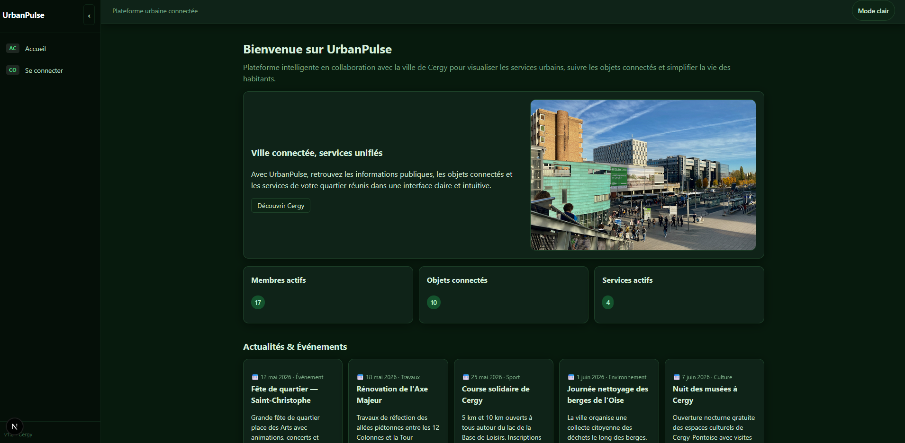
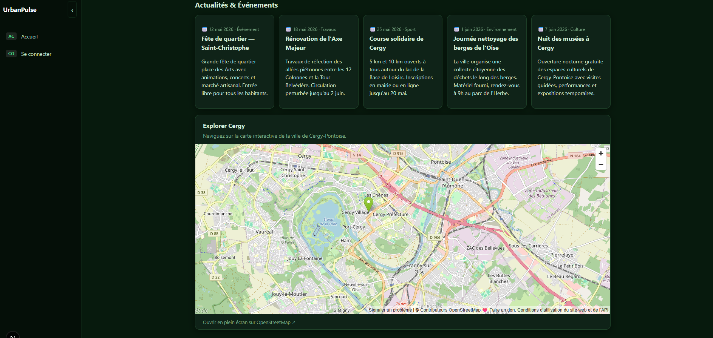

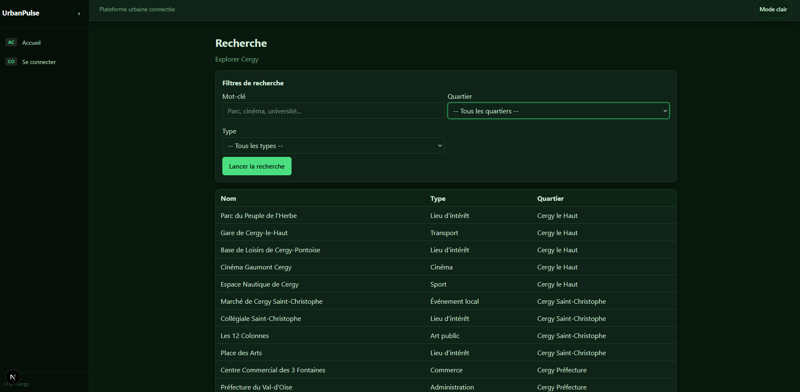
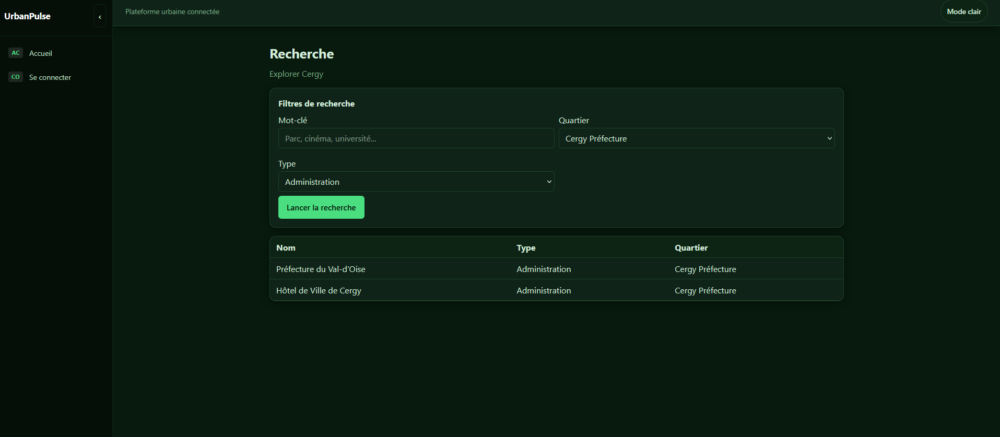

### 4.2 Module Authentification & Visualisation — habitant inscrit

Ce module gère tout le cycle de vie d'un compte.

L'**inscription** vérifie que le login est bien dans la liste des habitants autorisés de Cergy — on ne peut pas créer un compte avec n'importe quel nom. Un token de validation est généré, et un email peut être envoyé automatiquement.

La **validation du compte** se fait par l'administrateur depuis son tableau de bord. L'utilisateur est prévenu dès sa prochaine connexion (un flag `newly_validated` en base).

Chaque **connexion** attribue +0,25 points à l'utilisateur. La **mise à jour du profil** (prénom, nom, âge, genre, photo…) en attribue +0,20. Les points s'accumulent et permettent de progresser entre les niveaux : débutant, intermédiaire, avancé, expert.

La **liste des membres** et les **fiches individuelles** sont accessibles à tous les utilisateurs connectés.

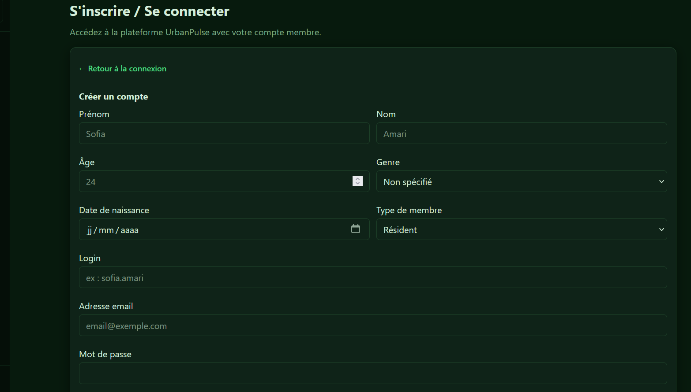

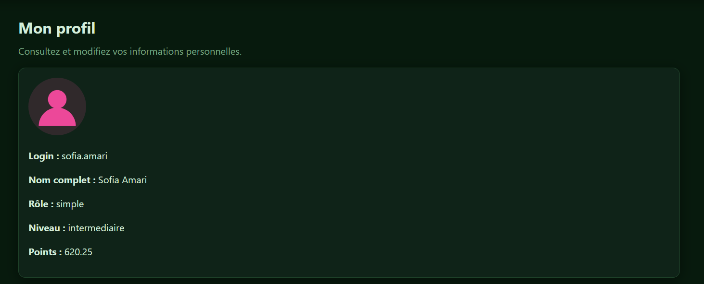
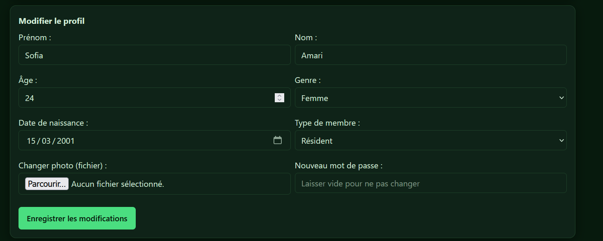

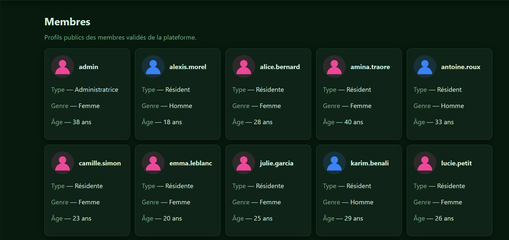

### 4.3 Module Gestion — gestionnaire (rôle complexe)

C'est le module développé par Ayoub. Il donne accès à la supervision des objets connectés déployés sur Cergy.

Le **tableau des objets** liste tous les appareils avec leur zone, leur état, leur consommation (kWh) et leur mode de fonctionnement. Pour chaque objet, trois actions sont disponibles :
- Activer ou désactiver en un clic
- Configurer le mode (Automatique, Manuel, Eco, Nuit, Surveillance continue)
- Envoyer une demande de suppression à l'administrateur avec une raison

Un **formulaire d'ajout** permet d'enregistrer un nouvel objet : nom, description, marque, zone parmi les 8 secteurs de Cergy, consommation énergétique.

La page **Configurations de services** liste les réglages en vigueur par zone et par service. Chaque réglage peut être modifié en ligne.

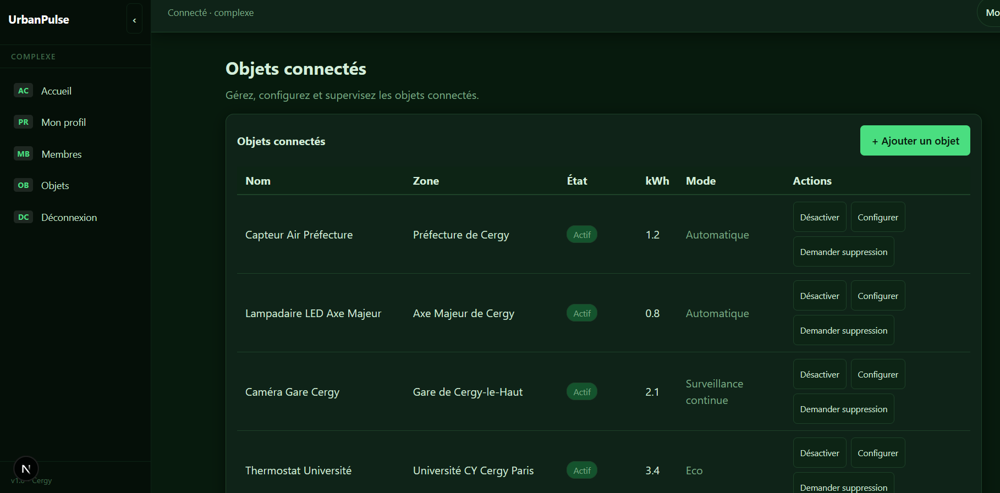

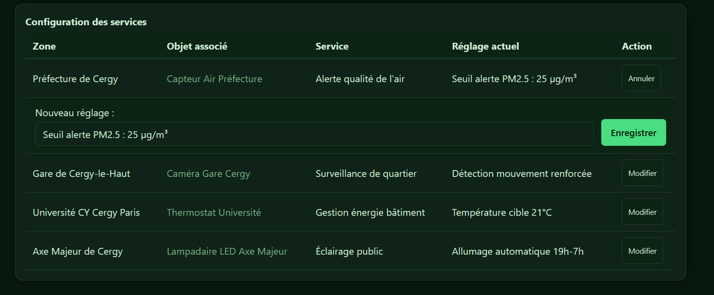

### 4.4 Module Administration — administrateur

Le module le plus fourni, développé par Taimim.

**Gestion des utilisateurs** : tableau complet avec changement de rôle en ligne, réinitialisation de mot de passe, ajout de points manuel, et suppression de compte (l'admin principal est protégé). Un formulaire permet aussi de créer directement un utilisateur déjà validé.

**Validation des inscriptions** : liste des comptes en attente. Un clic suffit pour valider.

**Catégories et règles** : ajout et suppression de catégories (type objet ou service) et de règles métier.

**Exports** : téléchargement en PDF ou CSV de la liste des utilisateurs, des objets connectés, et des habitants de Cergy non encore inscrits sur la plateforme.

**Personnalisation** : choix de la couleur d'accent du site (Bleu, Vert, Violet), mémorisé localement.


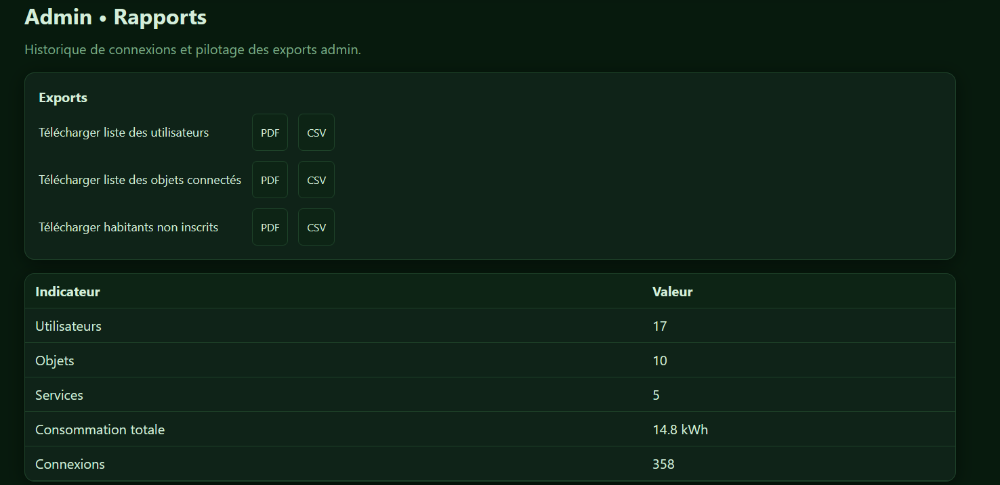

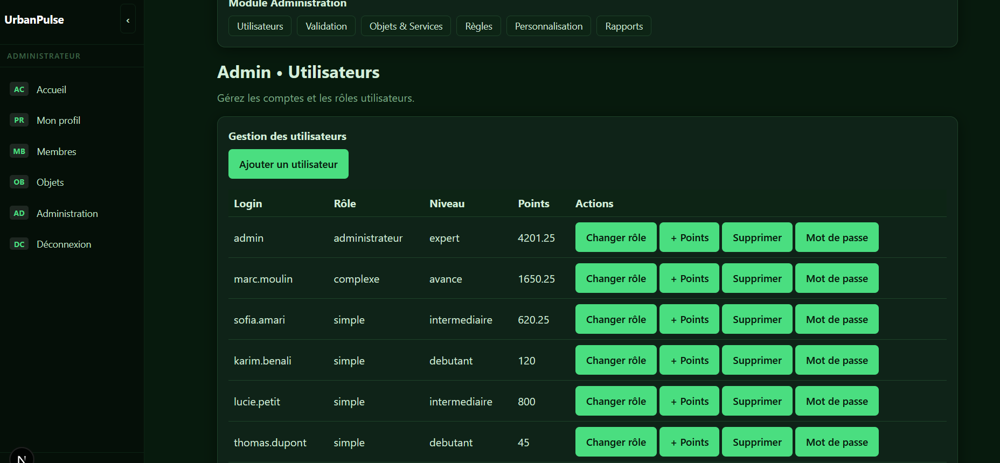

### 4.5 Tableau de conformité

| Exigence | Statut |
|---|---|
| Module Information accessible sans connexion | ✅ |
| Recherche avec au moins 2 filtres | ✅ (mot-clé + quartier + type) |
| Inscription avec validation administrateur | ✅ |
| Système de niveaux et points | ✅ |
| Gestion des objets connectés | ✅ |
| Rôles différenciés (simple / complexe / admin) | ✅ |
| Authentification sécurisée | ✅ (bcrypt + sessions) |
| Export des données (PDF + CSV) | ✅ |
| Base de données persistante | ✅ (SQLite) |
| Interface responsive | ✅ |
| Déploiement local en une commande | ✅ (`python run_site.py`) |

---

## 5. Conclusion

### 5.1 Ce qu'on retient

Ce projet nous a appris ce que ça représente vraiment de construire une application web complète : pas juste écrire du code, mais penser à la cohérence des données, aux droits d'accès, à ce qui se passe quand quelque chose échoue, et à comment s'organiser à quatre sans marcher sur les pieds des autres.

Sur le plan technique, le fait d'avoir implémenté l'authentification à la main, sans bibliothèque, nous a beaucoup apporté. De même, travailler avec SQLite directement depuis Next.js, sans ORM, nous a forcés à comprendre ce qui se passe vraiment en base.

### 5.2 Ce qui fonctionne bien

La plateforme est stable et couvre l'intégralité des modules demandés. Le système de points fonctionne de façon transparente en arrière-plan. Le script de lancement simplifie vraiment le déploiement local. Et le fallback sur des données locales quand l'API est indisponible donne une expérience propre même en cas de problème.

### 5.3 Ce qu'on ferait différemment ou en plus

Avec plus de temps, on aurait aimé ajouter des notifications en temps réel (l'administrateur recevrait une alerte dès qu'une inscription arrive, sans avoir à recharger la page), des graphiques d'évolution pour la consommation des objets, et un déploiement en ligne avec une vraie base PostgreSQL. On aurait aussi voulu écrire des tests automatisés plutôt que de tout tester à la main. Enfin, une traduction complète de l'interface en anglais aurait été une valeur ajoutée intéressante pour rendre la plateforme accessible à un public plus large.

---

## Annexes

### A. Endpoints API principaux

| Méthode | Route | Accès | Description |
|---|---|---|---|
| GET | `/api/health` | Public | Santé du serveur |
| GET | `/api/information/free-tour` | Public | Informations publiques |
| GET | `/api/information/search` | Public | Recherche multicritères |
| POST | `/api/auth/register` | Public | Inscription |
| POST | `/api/auth/login` | Public | Connexion |
| GET | `/api/auth/verify` | Public | Validation par lien email |
| GET/PATCH | `/api/users/me` | Simple+ | Profil utilisateur |
| GET | `/api/users/members` | Simple+ | Liste des membres |
| GET/PATCH | `/api/users/level` | Simple+ | Niveaux et points |
| GET/POST | `/api/objects` | Complexe+ | Liste / Ajout objets |
| PATCH | `/api/objects/:id` | Complexe+ | Modification objet |
| POST | `/api/objects/:id/toggle` | Complexe+ | Activation / Désactivation |
| POST | `/api/objects/:id/delete-request` | Complexe+ | Demande de suppression |
| GET/PATCH | `/api/services/configurations` | Complexe+ | Configurations de services |
| GET/POST | `/api/admin/users` | Admin | Gestion utilisateurs |
| PATCH/DELETE | `/api/admin/users/:id` | Admin | Modification / Suppression |
| GET | `/api/admin/pending` | Admin | Inscriptions en attente |
| POST | `/api/admin/pending/:id/approve` | Admin | Validation d'inscription |
| GET/POST/DELETE | `/api/admin/categories` | Admin | Gestion catégories |
| GET/POST/DELETE | `/api/admin/services/:id` | Admin | Gestion services |
| GET/POST | `/api/admin/rules` | Admin | Gestion règles |
| GET | `/api/admin/export/:type` | Admin | Export PDF / CSV |
| DELETE | `/api/admin/objects/:id` | Admin | Suppression définitive |

### B. Schéma de la base de données

```
users              : id, login, email, password, role, level, points,
                     is_validated, newly_validated, age, genre,
                     birth_date, member_type, photo_url,
                     first_name, last_name, created_at, updated_at

sessions           : id, token, user_id → users, created_at

validation_tokens  : id, token, user_id → users, created_at

allowed_members    : id, login

objects            : id, unique_id, name, description, brand, object_type,
                     status, zone, energy_kwh, mode, last_interaction

services           : id, name, description, status, category_id → categories

categories         : id, name, category_type

rules              : id, title, description, is_active, created_at

public_info        : id, title, description, info_type, city, status

service_configurations : id, zone, object_id → objects,
                         service_id → services, reglage

user_actions       : id, user_id → users, action_type, description, created_at

deletion_requests  : id, object_id → objects, user_id → users,
                     reason, created_at
```

